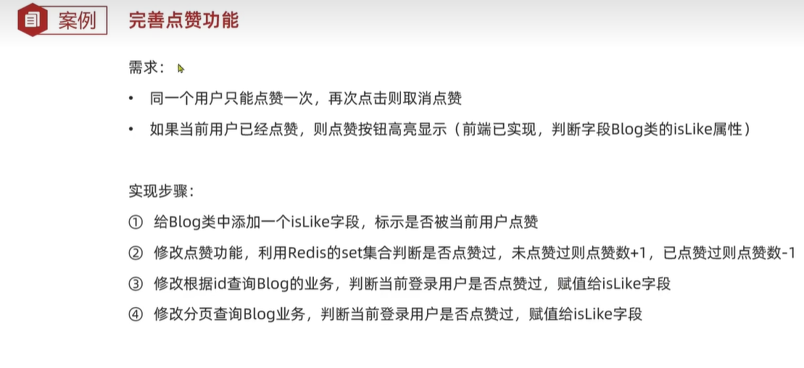

# hmdp
自学Redis用---黑马点评
## 代码结构：

## 主要学习内容：
    - 了解redis缓存穿透、缓存击穿、缓存雪崩以及对应解决方案
    - 基于Redisson实现分布式锁
    - 使用Redisson看门狗机制实现热点key的自动续期
    - 基于Redis的Stream结构作为消息队列实现异步秒杀
## 主要使用的技术栈
`Java` `SpringBoot` `redis` `mybatis plus`

## 业务功能
点赞：
